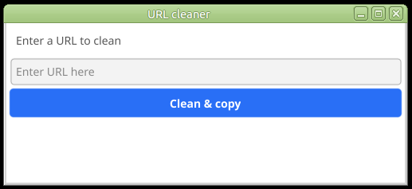

## URL cleaner

This is a small utility which cleans any query string from a URL.
This will remove Facebook trackers, Google trackers and any other query params.
To use, paste the URL in the input field and click "Clean & copy".
The cleaned URL is shown below the input field and is also copied to the system clipboard 
for easy sharing.

_Please note:_ Websites that depend on query parameters for state may get confused!

This is free software without any warranties.